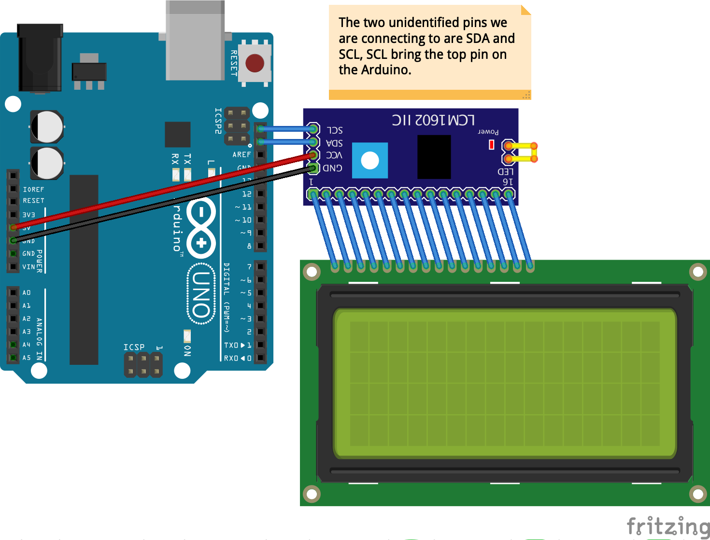
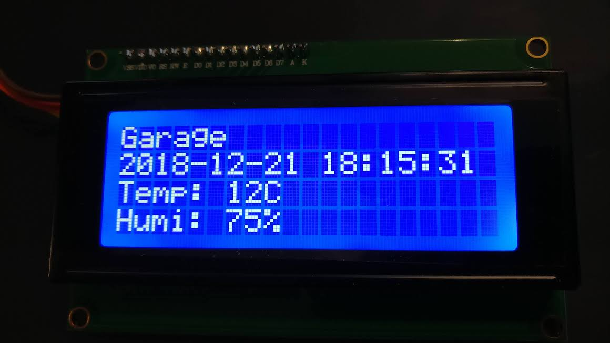

# LCD Demo

I was hoping to have a useful demo for the LCD module, but most of them did not
work out as expected. I found out later that the issues I was having has a lot
to do with the device I was using. It works fine, but has a few minor issues
you need to be aware of.

The biggest known issue with this LCD module is that we can't use the scrolling
mechanism, as it will take a string that extends through 80 chracaters and
write across line 1, then line 3, then line 2, and finally line 4. We have to
roll our own for such things, so keeping messages short, using setCursor() and
having a blank string to clear the lines would probably be the correct thing to
do.

For this example, we are using the LCD library located here:
https://bitbucket.org/fmalpartida/new-liquidcrystal/downloads/

To use it for the first time in a sketch, use the menus like this:
[sketch] -> [include library] -> [add .ZIP library] and select the downloaded
zip file you will get a bunch of #include lines. Delete all but the two used in
this sketch. Future use is similar, but use the newliquidcrystal library listed
in [contributed libraries] instead of [add .ZIP library].

So from my own observations after messing with it for a while:

* The text displayed is persistent, so you have to clear it 
* We can use setCursor to go to places on the screen
* This is best for displaying data that can be at fixed locations

## Wiring Diagram for LCD module

Maybe good for a date-time-temp-humidity display? Four lines is a bit of a
waste. We could draw a border to make it nicer, but if we did something like
this...

    Sensor ID
    YYYY-MM-DD HH:mm:ss (19 characters)
    Temp: XXC
    Humi: XX%

The sample code does this and uses random integers for the display numbers. If
you wanted to really do something with it, you would need a function to read
something like a DHT-22 and a RTC module so that you could track and timestamp
your readings.

## Sample Output
 

